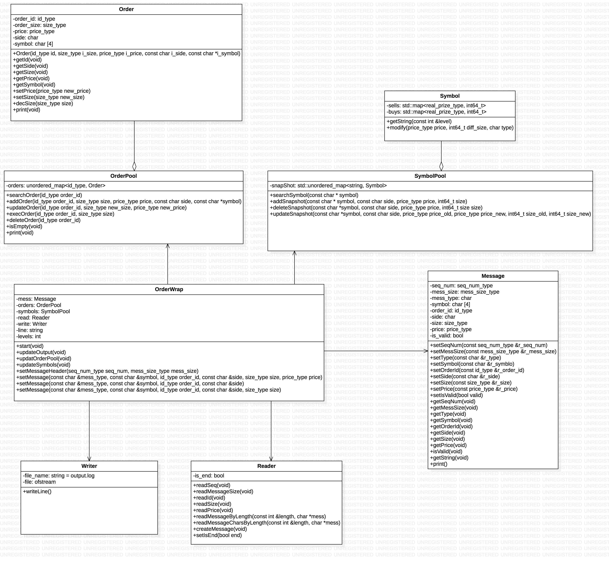

# Project Folder
```
snapShot
│
└───BookSystem
│   │
│   └───include      (.hpp for main)
│   │
│   └───src        (.cpp for main)
│
└───UnitTest    (.cpp google unit test)
│
└───googletest    (google unit test libs need download)
│
└───input   (input binary file)
│
└───Design (UML design)
```
# Install
git clone https://github.com/Joannazhx/order-snapshot.git<br>
## google test
for google unit test<br>
cd {folder_path}/googletest<br>
git clone https://github.com/google/googletest.git<br>

# execute
cd {folder_path}<br>
cmake .<br>
make<br>
## main<br>
cat {input_file_path} | ./order-snapshot {number}<br>
eg. cat input/input1.stream | ./order-snapshot 5<br>
results will be stored in output.log

## unit test
Unit test will also write into output.log, save and rename output.log before run unit test.<br>
./UNIT_TEST<br>


# UML



